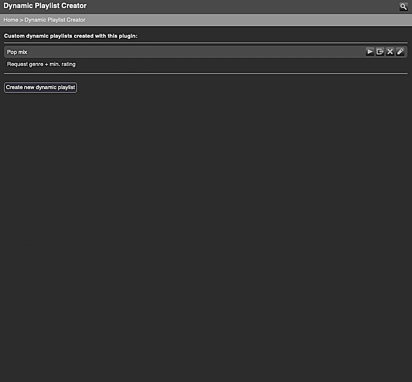

# Dynamic Playlist Creator
%3D'plugin'%20and%20%40name%3D'DynamicPlaylistCreator'%5D%2F%40minTarget&prefix=v&label=Min.%20LMS%20Version%20Required&color=darkgreen) &nbsp;
 

**Dynamic Playlist Creator** (DPLC) helps you create *custom* dynamic playlists for the *Dynamic Playlists* plugin using templates. 
The target group for this plugin is users who want to quickly and easily create custom dynamic playlists using **only** templates and do **not** want to work with raw SQLite statements. Accordingly, DPLC does not include the option to edit SQLite statements manually in the plugin (see [FAQ](#faq)).
  

> [!TIP]
> The templates allow you to create dynamic playlists for many purposes, but of course they do not cover all conceivable use cases. 
> Don't forget: the [**Dynamic Playlists**](https://github.com/AF-1/#-dynamic-playlists) plugin also allows you to use (raw) SQLite statements that you can customise exactly to your needs (see [Dynamics Playlists FAQ](https://github.com/AF-1/lms-dynamicplaylists#faq)).

  
[⬅️ **Back to the list of all plugins**](https://github.com/AF-1/)
  
**Use the** &nbsp;  &nbsp;**icon** (top right) to **jump directly to a specific section.**

  

## Screenshots[^1]

   

## Installation

**Dynamic Playlist Creator** is available from the LMS plugin library: **LMS > Settings > Manage Plugins**. 

If you want to test a new patch that hasn't made it into a release version yet, you'll have to [install the plugin manually](https://github.com/AF-1/sobras/wiki/Manual-installation-of-LMS-plugins).
    

## Report a new issue

To report a new issue please file a GitHub [**issue report**](https://github.com/AF-1/lms-dynamicplaylistcreator/issues/new/choose).
   

## ⭐ Help others discover this project

If you find this project useful, giving it a  (top right of this page) is a great way to show your support and help others discover it. Thank you.
    

## FAQ

»<b>How do I <i>create</i> custom dynamic playlists?</b>«
 

- Go to <i>LMS home menu</i> > <i>Extras</i> > <i>Dynamic Playlist Creator</i> > <i>Create new dynamic playlist</i>. 

- Depending on the focus of your new dynamic playlist, <b>select a template</b>. The <i>Random Tracks - Advanced</i> template with its many options is a good starting point. 

- Enter a <b>name</b>, set the <b>parameters</b> you want to use and then <b>save</b> it. That's it.  

It <b>takes a couple of seconds</b> for the <i>Dynamic Playlists</i> plugin to start updating the list of available dynamic playlists and your new dynamic playlist to show up there. If you don't see your dynamic playlists listed, you can force a refresh of available dynamic playlists by (re)entering the <i>Dynamic Playlists</i> menu from the <i>LMS home</i> menu.

 

»<b>How can I <i>edit</i> custom dynamic playlists I've created with this plugin?</b>«
 

<i>Dynamic Playlist Creator</i> displays a list of all dynamic playlists that you have created with this plugin. If you want to change the name of your dynamic playlist or some parameters, click on the <b>Edit</b> button next to the playlist's name, make your changes and save it. After a couple of seconds, the Dynamic Playlist plugin will update its list of available dynamic playlists and pick up the changes you just made.

 

»<b>Can I <i>edit the SQLite statement</i> of my dynamic playlists manually in DPLC?</b>« &nbsp;&nbsp;&nbsp;&nbsp;»<b>What does the <i>export</i> button do?</b>«
 

The target group for this plugin is users who want to quickly and easily create custom dynamic playlists using <b>only</b> templates and do <b>not</b> want to work with raw SQLite statements. Accordingly, DPLC does <b>not include the option to edit SQLite statements</b> manually in a tiny plugin text area.  

Users familiar with SQLite can <b>use the <i>export</i> button</b> to <b>permanently move</b> a dynamic playlist <i>currently managed by DPLC</i> to the <i>Dynamic Playlists</i> plugin, i.e. its folder for custom dynamic playlists called <b>DPL-custom-lists</b>. There you can edit it like any other custom dynamic playlist with your favorite code editor. 
Moved dynamic playlists are removed from and no longer managed by DPLC.  Please note: the <b>export</b> button is <b>disabled by default</b> and can be enabled in DPLC's settings.

 

»<b>When I <i>edit</i> my custom dynamic playlist, DPLC displays a <i>saved version</i> number and a <i>new version</i> number. What does that mean?</b>«
 

When I change/add template parameters or fix template bugs, the template version number increases. 
If you created your custom dynamic playlist using an older template version than the current one, this discrepancy is displayed next to the template name on the edit page.  
<b>Updating</b> your custom dynamic playlist (recommended) is as simple as <b>saving it</b> again. Even if you don't change any parameter (value), this will make DPLC update the SQLite statement of your custom dynamic playlist.

 

»<b>What are the files in the <i>DynamicPlaylistCreator</i> folder for? Can I edit them?</b>«
 

When you create or edit and then <i>save</i> a custom dynamic playlist, DPLC will create 2 files in the <i>DynamicPlaylistCreator</i> folder (default location in the LMS preferences folder, can be changed in the plugin settings): 

- the file with the <b>customvalues.xml</b> extension contains the (template) values you selected for this dynamic playlist. It allows you to edit or update your custom dynamic playlist in DPLC at a later time. 

- In addition, DPLC will <b>always</b> save your custom dynamic playlist as an SQLite statement (file extension: <b>sql</b>) because <i>Dynamic Playlists</i> searches the DPLC custom folder for them. 

<b>⚠️ Do <u><i>not</i></u> move or edit any of these files manually!</b> DPLC will overwrite the changes. Or worse, your custom dynamic playlist will no longer work. And please <b>do not rename the <i>DynamicPlaylistCreator</i> folder</b>.

 

»<b>I can't set a <i>file</i> name for <i>new</i> dynamic playlists in DPLC anymore.</b>«
 

<b>DPLC handles all file names internally</b>. They are <b>derived from the <i>dynamic playlist name</i></b> and special characters are removed or replaced. When you try to <i>save a new</i> dynamic playlist and DPLC finds a file with an identical file name, it will append a number to the end of the new file name so there will be no playlist ID conflicts. Once the dynamic playlist is saved, its <b>file</b> name (on which the playlist ID is based) won't change anymore, even if you change/edit the <b>playlist</b> name.

 

»<b>Why is the <i>Play button</i> not displayed for <i>all</i> dynamic playlists?</b>« &nbsp;&nbsp;&nbsp;&nbsp;»<b>The <i>Play</i> button is not working for new dynamic playlists.</b>«
 

The <b>play</b> button is <b>disabled by default</b> and has to be enabled in DPLC's settings first. 
You can <b>only</b> start dynamic playlists directly in DPLC that do <b><u>not</u> ask for user input when started</b>. DPLC does not contain code to handle user-input parameters. To simplify the maintenance and updating of the plugin, I decided to create DPLC as a sort of dynamic playlist construction kit without duplicating any code from the <i>Dynamic Playlists</i> plugin.  After you have created a <b>new</b> dynamic playlist that does not ask for user input, please wait a few seconds before you try to start it with the <i>Play</i> button. <i>Dynamic Playlists</i> needs a moment to update the list of available dynamic playlists.  Starting dynamic playlists without user-input parameters in DPLC is just a quick way to test a dynamic playlist. The <i>Dynamic Playlists</i> plugin is still where you start your mixes, not DPLC.

 

»<b>Which plugins does DPLC work with?</b>«
 

It works with <a href="https://github.com/AF-1/#-dynamic-playlists"><b>Dynamic Playlists</b></a>, <a href="https://github.com/AF-1/#-alternative-play-count"><b>Alternative Play Count</b></a>, <a href="https://github.com/AF-1/#-custom-skip"><b>Custom Skip</b></a> and <a href="https://github.com/AF-1/#-custom-tag-importer"><b>Custom Tag Importer</b></a>.

 

»<b>In some DPLC templates there's no option to set a <i>track limit</i> and no <i>do not repeat</i> setting.</b>«
 

Dynamic playlists that <b>use the LMS cache</b> cannot have a track limit because <i>Dynamic Playlists</i> will load <b>all</b> track IDs matching the active dynamic playlist's search parameters into the cache using a single initial database query. The cached track ID list should not have duplicates, hence no <i>do not repeat</i> option. DPL will add small batches of tracks from this cached list to the players's current playlist. The number of new unplayed tracks to be added per batch can be set in the DPL settings. It's a global setting for all dynamic playlists (except album dynamic playlists which should add complete albums).

 

»<b>Does DPLC handle online tracks?</b>«
 

DPLC creates dynamic playlists for the <i>Dynamic Playlists</i> plugin which will process <b>online tracks</b> that have been <b>added to your LMS library as part of an <i>album</i></b>. LMS does not import <b>single</b> online tracks or tracks of <i>online</i> <b>playlists</b> as <b>library</b> tracks and therefore these won't be processed by <i>Dynamic Playlists</i>.

 

»<b>How do I use custom tags from the <i>Custom Tag Importer</i> plugin?</b>«
 

You can use up to 8 custom tags with templates that support custom tags from the <i>Custom Tag Importer</i> plugin. If you use different logical operators (and/or) to link them, please make sure that you <b>group the custom tags</b> <i>linked by AND</i> and <i>those linked by OR</i>.  <i>Example:</i> if you have 5 custom tags (A, B, C, D, E) and you definitely want 2 of them (A, B) and one of the remaining 3 (C, D, E), put them in this order: A <b>and</b> B <b>and</b> ( C <b>or</b> D <b>or</b> E ). The 2 ANDs first, then the ORs. Both groups are linked by AND.

 

»<b>I <i>can't save</i> new dynamic playlists. I get this error message: “Could not create the <i>DynamicPlaylistCreator</i> folder“.</i></b>«
 

The <i>DynamicPlaylistCreator</i> folder is where DPLC stores all files related to your custom dynamic playlists and where the <i>Dynamic Playlists</i> plugin expects to find them. The folder name is hard-coded and must not be changed. 
On every LMS (re)start, DPLC checks if there's a folder called <i>DynamicPlaylistCreator</i> in the parent folder. The default <b>parent</b> folder is the <i>LMS preferences folder</i> but you can change that in DPLC's preferences. If it doesn't find the folder <i>DynamicPlaylistCreator</i> inside the specified parent folder, it will try to create it.  
The most likely cause for the error message above and matching error messages in the server log is that DPLC can't create the folder because LMS doesn't have read/write permissions for the parent folder (or the <i>DynamicPlaylistCreator</i> folder).  
So please make sure that <b>LMS has read/write permissions (755) for the parent folder - and the <i>DynamicPlaylistCreator</i> folder</b> (if it exists but cannot be accessed).

 

»<b>Can I import my custom dynamic playlists from the <i>SQLPlayList</i> plugin?</b>«
 

You <b>can't</b> migrate dynamic playlist definitions from the <i>SQLPlayList</i> plugin to <i>Dynamic Playlist <b>Creator</b></i>. They are based on templates which are different from the ones that DPLC uses.

 

»<b>Can this plugin be <i>displayed in my language?</b>«
 

This plugin will not be localized because the parameter and value names in the templates are hard-coded. And a halfway localized version is worse than a non-localized one.

 
 

[^1]: The screenshots might not correspond to the UI of the latest release in every detail.
